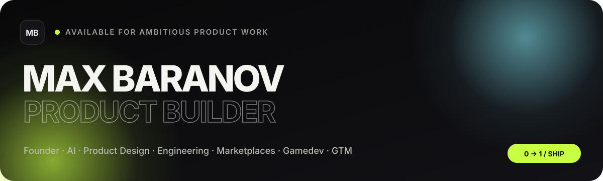

  

  <strong>Founder · Product Builder · Designer · Developer</strong> 
  Building AI-native products where design, engineering and business meet.

  
  
  

## About

I build products end to end — from **positioning, UX and design systems** to **architecture, code, AI workflows and go-to-market**.

My background combines **8+ years in marketing leadership**, hands-on product development, 3D and gamedev. I like problems that sit between disciplines: where a product decision becomes a design decision, an architecture decision and a distribution decision at the same time.

> **Current focus:** AI tooling, local-first software, marketplaces, creative production systems and 0→1 products.

## Selected work

<table>
<tr>
<td width="50%" valign="top">

### [DesignDNA](https://github.com/MaxBaranov1993/designdna)
**Local-first AI web-design studio**

Import live websites as editable layers, extract UI systems, generate on-brand sections and route work between GPT / Claude while keeping the design structure controllable.

AI · Svelte · Python · Electron · FastAPI · Design IR

</td>
<td width="50%" valign="top">

### [RSale](https://rsale.net)
**Multilingual classifieds marketplace for Serbia**

Search-first marketplace with geospatial discovery, real-time features, scalable SEO and a production architecture built around SvelteKit, .NET and PostgreSQL.

SvelteKit · .NET 8 · PostGIS · Redis · Meilisearch · SignalR

</td>
</tr>
<tr>
<td width="50%" valign="top">

### [Lofty](https://github.com/MaxBaranov1993/LoftyMusic)
**AI music generation platform**

Generative audio system with asynchronous jobs, distributed GPU execution and fine-tuning infrastructure.

Python · FastAPI · GPU · Celery · LoRA

</td>
<td width="50%" valign="top">

### [Trim](https://github.com/MaxBaranov1993/Trim)
**PBR texture atlas builder**

Browser-based graphics tool combining a precise visual editor with fast image-processing workflows.

TypeScript · Svelte · Rust · WASM · PixiJS

</td>
</tr>
<tr>
<td width="50%" valign="top">

### TaskTracker
**Production platform for 3D / VFX / game teams**

Multi-tenant task and asset workflow with real-time Kanban, versioning and DCC-oriented production logic.

Next.js · .NET 8 · SignalR · MinIO

</td>
<td width="50%" valign="top">

### [Critical Shift](https://store.steampowered.com/app/3395320/Critical_Shift/)
**Game development · 3D · scripting**

Hands-on game-development experience spanning 3D art, scripting and real-time production pipelines.

Gamedev · 3D Art · Scripting · Steam

</td>
</tr>
</table>

## Stack

**Product & AI**

**Frontend**

**Backend & systems**

**Creative**

## How I work

<pre>
idea → positioning → UX → system design → implementation → ship → distribution
</pre>

I use AI models as active collaborators for research, design and engineering, while keeping product logic, data structures and deterministic systems explicit in code.

---

  <strong>Build things worth shipping.</strong> 
  AI · Product · Design · Engineering · GTM

